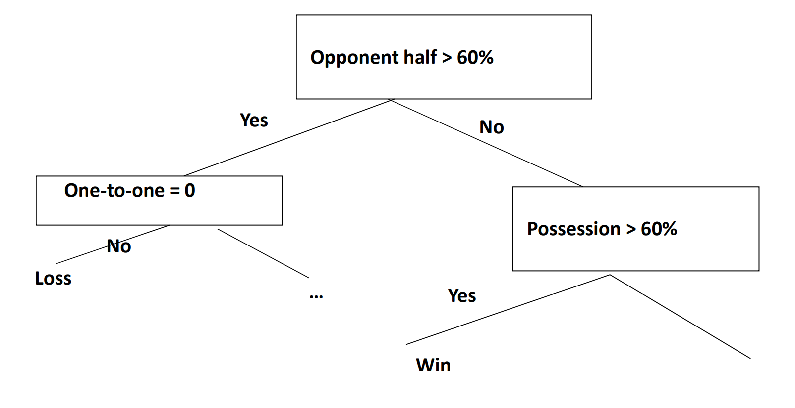
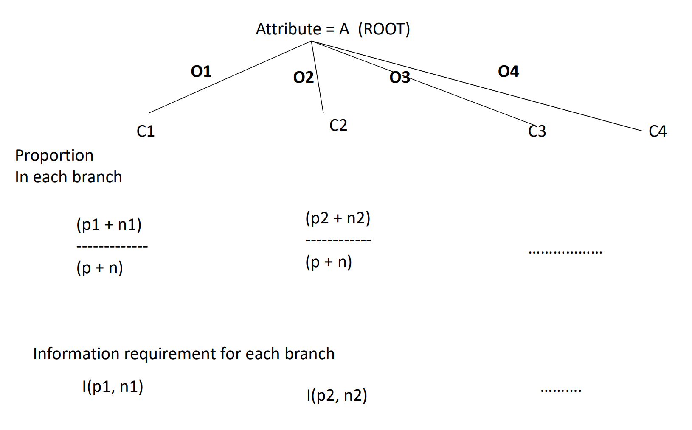

# DECISION TREES

## INPUT AND OUTPUT

- Input: A vector of attribute values
- Output: Decision (e.g., Yes/No, Win/Tie/Loss) – Each leaf node provides an output

## DECISION TREE LEARNING

- Decision tree reaches its decision by performing a sequence of tests

## REPRESENTATION

- each internal node represents test of attribute
- Branches represent possible values of the attribute

## Example

### Problem

Predicting the outcome of a RoboCup Soccer game after first few minutes of play, Assume no goals scored yet

Here the aim is to learn a function that will tell us if a team will:

- Win Big: > 5 goals difference with the opponent 
- Win: 1-5 goal difference 
- Tie: No goal difference 
- Lose: Opponent outscores by 1 to 5 goals 
- Lose big: Opponent outscores by more than 5 goals

### Relevant Attributes

- Possession time: What percent of time ball with team? 
- % time ball in opponent half – Placement of opponent’s defenders 
- Opponent playing along sidelines or the center 
- One-on-one with opposition with opposition goal keeper

### Example decision tree

## EXAMPLE INPUT FOR DECISION TREE LEARNING

| Number | Outlook  | Temp | Humid  | Windy | Class |
| ------ | -------- | ---- | ------ | ----- | ----- |
| 1      | Sunny    | hot  | high   | false | N     |
| 2      | Sunny    | hot  | high   | true  | N     |
| 3      | overcast | hot  | high   | false | P     |
| 4      | rain     | mild | high   | false | P     |
| 5      | rain     | cool | normal | false | P     |
| 6      | rain     | cool | normal | true  | N     |
| 7      | overcast | cool | normal | true  | P     |
| 8      | sunny    | mild | high   | false | N     |
| 9      | sunny    | cool | normal | false | P     |
| 10     | rain     | mild | normal | false | P     |
| 11     | sunny    | mild | normal | true  | P     |
| 12     | overcast | mild | high   | true  | P     |
| 13     | overcast | hot  | normal | false | P     |
| 14     | rain     | mild | high   | true  | N     |

## Selecting Order of Tests

- Intuition: Best to cleanly separate the sets into positive
and negative
- We can have mixed sets too (50-50) etc.
- To formalize this idea, we need a function that differentiates between cleanly separated sets and mixed sets.
- This function would be based on **INFORMATION GAIN**

## Information gain

Information gain is based on information necessary to classify an example

Expected information needed to classify an example instance is given by the following formula:

I(p,n) = - p/(p+n) ln p/(p+n) - n/(p+n) ln n/(p+n)

This can be extended to k other classes too!

### Examples

#### example 1

In the example, out of 14 objects in our example, 7 are P and 7 are N.
  n = p = 7

Information required for classification is therefore:

I(p,n) = - 7/14 log (7/14) - 7/14 log (7/14) = 1 bit

#### example 2

Out of 14 objects in our example, 9 are P and 5 are N
  n = 5, p = 9

Information required for classification is therefore:

I(p,n) = - 5/9 log (5/9) - 9/5 log (9/5) = 0.940

## The overall situation…

There are several attribute tests possible

### outlook attribute

This test divides the set with values {sunny, overcast, rain}
    - Division is {5 (sunny), 4 (overcast), 5 (rain)}

- 5 (Sunny) => 2 P, 3 N => I(p1,n1) = 0.971
- 4 (overcast) => 4 P, 0 N => I(p2, n2) = 0
- 5 (rain) => 3 P, 2 N => I(p3, n3) = 0.971

E(outlook) = 5/14 x I(p1,n1) + 4/14 x I(p2,n2) + 5/14 x I(p3, n3) = 0.346 + 0 + 0.346 = 0.694 bits

- Gain (outlook) = 0.940 – E(outlook) = 0.246 bits

### Temperature attribute

This test divides the set with values {hot, mild, cool}
    – Division is {4 (hot), 6 (mild), 4 (cool)} – Further we have the following:
• 4 (hot) => 2 P, 2 N =>  I(p1,n1) = 1
• 6 (mild) 6 (mild) =>  4 P, 2 N 4 P, 2 N =>  I(p2, n2) = … I(p2, n2) = …
• 4 (cool) =>  3 P, 1 N =>  I(p3, n3) = .8075
• E(temperature) = 4/14 x I(p1,n1) + 6/14  x  I(p2,n2) + 4/14  x  I(p3, n3) = 0.285 + 0.396 + 0.230 = 0.911 bits
• Gain (temp) = 0.940 – E(temp) = 0.029 bits

## Which Test First

- Gain(outlook) = 0.246 bits
- Gain (temperature) = 0.029 bits
- Gain (humidity) = 0.151 bits
- Gain (windy) = 0.048 bits

- So choose outlook as the attribute for root of decision tree
- Objects divided into subsets according to values of outlook attribute
- Decision tree for each subset induced in a similar fashion
- Smaller decision tree generated by this procedure
